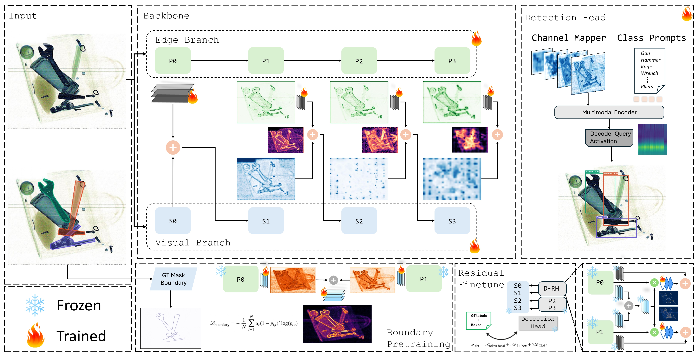

<h1>
  <strong>DERA</strong>: Detached Edge-Residual Adaptation for Prohibited item Detection
</h1>

---

<p align="center">
  <a href="https://scholar.google.com/citations?user=1NgtYpwAAAAJ&amp;hl=en">Yonathan Michael</a><sup>1</sup>,
  <a href="https://scholar.google.com/citations?user=dLQ1jLkAAAAJ&amp;hl=en">Mohamad Alansari</a><sup>1</sup>,
  <a href="https://scholar.google.com/citations?user=ylX5MEAAAAAJ&amp;hl=en&amp;oi=ao">Mohammed Bennamoun</a><sup>2</sup>,
  <a href="https://scholar.google.com/citations?user=j5K7HPoAAAAJ&amp;hl=en&amp;oi=ao">Dwarikanath Mahapatra</a><sup>1</sup>,
  <a href="https://scholar.google.com/citations?user=jenl24IAAAAJ&amp;hl=en&amp;oi=ao">Andreas Henschel</a><sup>1</sup>,
  <a href="https://scholar.google.com/citations?user=G_2Xpm0AAAAJ&amp;hl=en">Naoufel Werghi</a><sup>1</sup>
</p>

<p align="center">
  <sup>1</sup>Khalifa University, Abu Dhabi, UAE<br>
  <sup>2</sup>University of Western Australia, Perth, Australia
</p>

---

DERA is an edge-aware, text-conditioned detector for prohibited-item
localization in X-ray images. It extends Grounding DINO with a parallel
pixel-difference stream, a mask-supervised boundary prior, and two lightweight
residual adapters. Masks are used only while learning the boundary head;
inference needs an image and category prompts.

## Pipeline



## Install

Linux, an NVIDIA GPU, and CUDA 12.1 are the reference setup. The pinned clean
recipe targets the MMDetection-supported `mmcv==2.1.0`; no compatibility
checks are disabled. Validate the recipe on a fresh machine before release.

```bash
conda env create -f environment/environment.yml
conda activate dera
pip install -e .
dera doctor
```

The Conda and Docker recipes, including offline setup, are in
[docs/REPRODUCE.md](docs/REPRODUCE.md).

## Prepare data

Datasets are not distributed in this repository. Arrange a supported dataset
as described in [docs/REPRODUCE.md](docs/REPRODUCE.md), then validate it before
training:

```bash
dera data validate --dataset pidray --data-root data/PIDray --require-masks
```

The boundary stage requires segmentation annotations. Foundation training,
residual training, evaluation, and inference use detection annotations only.

## Train DERA

Run the complete sequence. The first run downloads the official Grounding
DINO initialization referenced by the foundation config:

```bash
dera pipeline \
  --dataset pidray \
  --data-root data/PIDray \
  --work-dir runs/pidray
```

Or run each stage explicitly:

```bash
dera train --dataset pidray --stage foundation \
  --data-root data/PIDray --work-dir runs/pidray/foundation

dera train --dataset pidray --stage boundary \
  --data-root data/PIDray --work-dir runs/pidray/boundary \
  --init-checkpoint "$(cat runs/pidray/foundation/selected_checkpoint)"

dera train --dataset pidray --stage residual \
  --data-root data/PIDray --work-dir runs/pidray/residual \
  --init-checkpoint "$(cat runs/pidray/boundary/selected_checkpoint)"
```

`--init-checkpoint` starts a new stage with a fresh optimizer. Use `--resume`
only to continue an interrupted run of the same stage. Each command records
its validation-selected or latest checkpoint in `selected_checkpoint`. The
full stage and checkpoint contract is in
[docs/REPRODUCE.md](docs/REPRODUCE.md).

## Evaluate and infer

This code-only repository does not bundle model weights. Train the pipeline or
download a release checkpoint whose checksum is recorded in the manifest.

```bash
dera evaluate --dataset pidray --data-root data/PIDray \
  --checkpoint checkpoints/dera_final.pth --work-dir runs/pidray/eval

dera infer --dataset pidray --checkpoint checkpoints/dera_final.pth \
  --image sample.png --prompts "knife; scissors; gun" \
  --out-dir outputs
```

Released weight metadata and checksums belong in
[`checkpoints/manifest.json`](checkpoints/manifest.json); model files are never
committed to Git.

## Repository map

```text
dera/           DERA-owned model and training code
third_party/    isolated, attributed PiDiNet/PDC-derived code
configs/        shared recipes plus thin dataset overlays
dataset_specs/  dataset layout and category contracts
tests/          unit, phase-isolation, and smoke tests
docs/           concise reproduction guide
```

## Supported datasets

The configuration interface includes PIDray, CLCXray, and STCray. Users must
obtain each dataset from its official source and comply with its terms.

## Intended use and limitations

DERA is intended for reproducible research and method development. It is not a
certified screening system and must not be the sole basis for safety-critical
decisions. Results depend on scanner characteristics, prompts, annotation
policy, dataset bias, and domain shift; small, occluded, overlapping, or weakly
visible objects may be missed, and confidence scores may be miscalibrated.
Report the exact dataset split, prompt order, checkpoint checksum, resolved
configuration, software environment, seed, and metrics as described in
[docs/REPRODUCE.md](docs/REPRODUCE.md).

## License and citation

DERA-authored code is available under Apache-2.0. Third-party components keep
their own terms; PiDiNet's upstream license contains an explicit research-only
sentence, so read [THIRD_PARTY_LICENSES.md](THIRD_PARTY_LICENSES.md) before
redistribution or commercial use.

Citation metadata is provided in [CITATION.cff](CITATION.cff). Please also cite
Grounding DINO, Swin Transformer, PiDiNet, MMDetection, and the dataset used.
